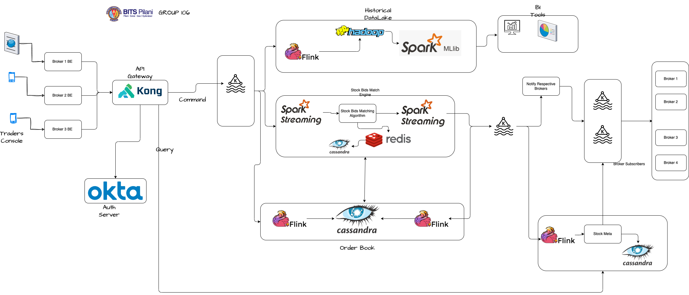

# StockExchangeDemo

## High Level Architecture Diagram 

## Start Message broker and streaming engine

Start Zookeeper 
> bin/zookeeper-server-start.sh config/zookeeper.properties

Start Kafka 
> bin/kafka-server-start.sh config/server.properties

Start Confluent KsqlDb 
> bin/ksql-server-start ./etc/ksqldb/ksql-server.properties

Create topic 

> ./kafka-console-producer.sh --broker-list localhost:9092 --topic incoming_orders 

## Start Mock Server

> FLASK_APP=spaexchange.py flask run --debugger

*** Start KSQL DB and create streams mentioned in the document attached.

